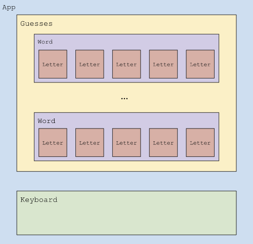
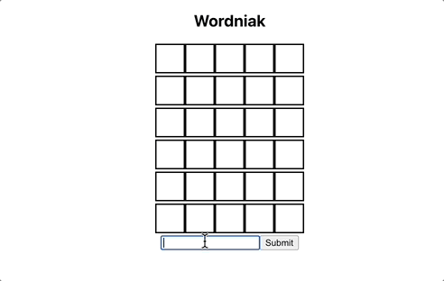
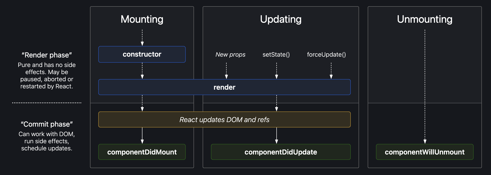
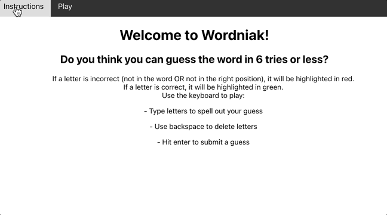

# Introductory React Concepts
## Additional Practice - Build **`Wordniak`**, a Wordle Clone

This document provides additional practice on the following objectives: 
- Describe the purpose and benefits and drawbacks of React in full stack JavaScript development.
- Recognize and write JSX syntax.
- Build functional React components.
- Build class-based React components.
- Use `.map()`, other array methods to generate dynamic lists in JSX
- Describe the React component lifecycle and the relationship between React and the Document Object Model (DOM).
- Explain the role and importance of state in React
- Manage local state in React.
- Compose components that pass state to each other via props
- Explain and use the common basic hooks for React functional components 
- Fetch data from an API and render it using React.
- Manage user form interface states with useState
- Determine the appropriate location for state
- Define a Single Page Application (SPA).
- Create a single page application
- Build out front-end routing for a single-page application using React Router.


## Contents
- [Review](#review)  
  - [Part I - Recapping Some React Concepts](#part-i-recapping-some-react-concepts)
- [Practice](#practice)  
  - [Part II - Adding Components to the Starter Code](#part-ii-adding-components-to-the-starter-code)
  - [Part III - Defining Routes](#part-iii-defining-routes)
- [Submission](#submission)

---

## Review

### Part I Recapping Some React Concepts

#### Benefits & Drawbacks

React is a component-based library developed by Facebook. It is one of the more popular libraries and something you’ll likely use on the job. But like any technology, it does come with tradeoffs.

| Benefits | Drawbacks |
|----------|-----------|
| <ul><li>Easy to learn - lots of documentation & tutorials available</li><li>Allows us to embed HTML in our JavaScript through JSX</li><li>Component-based structure allows us to create encapsulated & reusable pieces</li><li>Usage of the Virtual DOM helps speed up performance</li></ul> | <ul><li>Frequent updates to React mean that developers have to stay on top of changes and be comfortable relearning how to do things</li><li>React only covers the View (UI) layer of your app, so if using MVC architecture, you need to also use additional libraries and tools</li><li>Requires familiarity with JSX</li></ul> |

#### Writing `HTML` in React with `JSX`

`JSX` is a syntax extension to JavaScript and produces React “elements”. 

##### *Why do we use it?*

React embraces the fact that rendering logic is inherently coupled with other UI logic: how events are handled, how the state changes over time, and how the data is prepared for display. Instead of artificially separating technologies by putting markup and logic in separate files, React separates concerns with loosely coupled units called “components” that contain both. 

##### *How do we use it?*

When using JSX, we can embed any valid JS expression inside a pair of curly braces. For example, we can declare a variable called `name` and use it inside JSX:

```js
const name = 'Josh Perez';
const element = <h1>Hello, {name}</h1>;
```

Or, we can embed the results of calling a JS function into an `<h1>` element:
```js
function formatName(user) {
 return user.firstName + ' ' + user.lastName;
}
 
const user = {
 firstName: 'Harper',
 lastName: 'Perez'
};
 
const element = (
 <h1>
   Hello, {formatName(user)}!
 </h1>
)
```

If you’d like to review more about JSX, check out the [🔗 Introducing JSX](https://reactjs.org/docs/introducing-jsx.html) or 
[🔗 JSX In Depth](https://reactjs.org/docs/jsx-in-depth.html) sections in the React Docs.

You will have an opportunity to practice writing your own JSX in the Wordle clone project detailed below.

#### State in React
We will practice manipulating state throughout the project below. A few things to keep in mind when working with React state -

##### State CANNOT Be Modified Directly
> When working with state in React, it is important to note that we CANNOT modify it directly. We MUT call `setState()` to change values within state. Additionally, you should be mindful that state updates may be _asynchronous_.

##### Data Flows Down
>When we create components in React, they can choose to pass down their state as props to child components. This data only flows in one direction - down. 

##### Only Using Local State is Hard with Larger Apps
> In a scenario where multiple components need access to the same piece(s) of information, we might want to start thinking about managing our state with a [**Redux store**](https://redux.js.org/tutorials/fundamentals/part-1-overview). But that is a topic for another day.


---

## Practice

### Part II Adding Components to the Starter Code

#### Get familiar with the project
1. Get the starter code by forking [🔗 this GitHub repo]()

    a. Install dependencies
    ```bash
    npm run install
    ```

    b. Start the app
    ```bash
    npm run start
    ```

2. Look over the code that's been provided. The main entry point for the React app is in `src/App.js`.

    We've broken down the **`Wordniak`** gameplay area into several different components, as shown in the diagram below:

    

    The files for all of the components you'll be implementing are in the `src/components` directory. These files are empty for now - you'll work on completing them later on.

    Some styling has been done for you. We won't be diving into that in this project, since the focus is React, but if you want to look at what has been done or would like to add some of your own styling, check out `src/index.css`.  

#### Set up a few components  

We’ll use a combination of function & class components in this project so you have an opportunity to practice using both.

| Function component | Class component |
|----------|-----------|
| <ul><li>Do NOT use `render()` function</li><li>Only accept `props` as argument</li><li>Stateless</li></ul> | <ul><li>Use `render()` function to return elements</li><li>Have option to both use `props` and `setState()`</li><li>Stateful</li></ul> |

##### Functional Components

3. Write the `Instructions` component  
    a. Open `components/Instructions.js` and create a new empty function.
    ```js
    const Instructions = () => {
        // add next steps here
    }
    ```
    b. Inside the function, return a single `<div>` that displays instructions for the game.
    ```js  
    const Instructions = () => {
        return (
            <div>
                <h1>Welcome to Wordniak!</h1>
                <h2>Do you think you can guess the word in 6 tries or less?</h2>
                // add other instructions here
            </div>
        );
    };
    ```
      
    c. Export your newly created functional component once you've finished writing your instructions!
    ```js
    export default Instructions;
    ```

4. Write the `Letter` component  
    a. Open `components/Letter.js` and create a new functional component, similar to `Instructions`.
    ```js
    function Letter(props) {
        return (
            // add 4b here
        );
    }

    export default Letter;
    ```
    
    b. Render the character text and style with the background color provided via props.
    <details>
    <summary>Solution</summary>

    ```js
    <span style={{ display: 'inline-block', borderStyle: 'solid', backgroundColor: props.info.color, width: 40, height: 40}}>
        {props.info.text}
    </span>
    ``` 

    </details>
    
5. Write the `Word` component  
    a. Set up the component  
    <details>
    <summary>Solution</summary>

    ```js
    import Letter from "./Letter.js";

    function Word(props) {
        // add 5b here

    // add 5c here

    }

    export default Word;
    ```

    </details>
    
    
    b. Iterate over each character in a word and compare it to the corresponding character in the answer. We'll conditionally select a background color (red or green) for characters, depending on if they match the answer. Both the individual character and its background color will be passed as props to the `Letter` component.
    ```js
    import Letter from "./Letter.js";

    function Word(props) {
        let letterItems = [];
        let letters = props.info.text.split("");
        for(let i=0; i<letters.length; i++) {
            let letter = letters[i];
            if(letter === props.info.answer[i]) {
                letterItems.push(
                    <Letter info={{text: letter , color:'green'}} key={i} />
                );
            }
            else {
                letterItems.push(
                    <Letter info={{text: letter , color:'red'}} key={i}/>
                );
            }
        }
        // add 5c here
    }

    export default Word;    
    ```

    c. After building up an array of `Letter` components, we can render that element and return the top-level `<div>`.
    
    <details>
    <summary>Solution</summary>

    ```js
    return (
        <div>
            {letterItems}
        </div>
    );
    ```  

    </details>

##### Class Components

6. Write the `Guesses` component. 
Since we'll be setting this up as a **class component**, you'll notice a few things that are different from the previously implemented components.   

    a. All class components extend `React.Component`
    ```js
    import React from "react";
    import Word from "./Word.js";
    import wordBank from '../wordBank';

    class Guesses extends React.Component {
        // add the constructor here
    }
    ```

    b. The constructor for a React component is called before it is mounted. When implementing the constructor for a `React.Component` subclass, you should call `super()` before any other statement. Add the constructor shown below to your `Guesses` class.
    ```js
    constructor(props) {
        super(props);
        // generate a random index to select a new word to guess
        this.state = { 
            answer: null,
            g: 0,
            curGuess: "",
            guesses: [{key: "1", text: "     "}, {key: "2", text: "     "}, {key: "3", text: "     "}, {key: "4", text: "     "}, {key: "5", text: "     "}, {key: "6", text: "     "}]
        }

        this.type = this.type.bind(this);
        this.submit = this.submit.bind(this);
        this.resetState = this.resetState.bind(this);
    }

    // add render() method here
    ```

    > React wants you to supply a special attribute to the JSX you return from your map called **`key`**. Remember that part of what makes React's virtual DOM so performant is that it can calculate the minimum number of changes to make the actual DOM. However, when we create JSX in a loop (like when we use `Array.prototype.map`), it gets hard for React to keep track of the DOM structure. To help React boost its lookup time for these elements, we give the parent of each set of JSX we return from the loop a value called a `key` that should be unique within the loop.

    c. The JSX describing our view is reurned by a method called `render()`. This is a special method that all class components must have. Add the `render()` method under our previously defined constructor. 

    Also note, within the `render()` method below is an example of props being passed down from `Guesses` to `Word`.

    ```js
    render() {
        var listItems;
        if(this.state.answer) {
            listItems = this.state.guesses.map((guess) =>
                <Word info={{text: guess.text, answer: this.state.answer}} key={guess.key}/> ); 
        }

        return (
            <div>
                <h2>Wordniak</h2>
                {this.state.answer ? <div>{listItems}</div> : <div>...Loading</div>}
                <input id="guessInput" value={this.state.curGuess} type='text' onChange={this.type}></input>
                <button onClick={this.submit}>Submit</button>
            </div>
        );
    }
    ```

    d. Finally, we will need to export our class component the same way that we exported our function components.
    ```js
    export default Guesses;
    ```

At this point, you should have functional gameplay!  



However, you might have noticed we only have one word in the `wordBank`. In the sections below, we'll talk through how to grab more words from a third party API so users get a different word every time they play

##### Lifecycle Methods

Each React component has several “lifecycle methods” that you can override to run code at particular times in the process. We've already used one - the constructor.



You can see more details about these methods in [🔗 The Component Lifecycle](https://reactjs.org/docs/react-component.html#the-component-lifecycle) section of the React docs.

7. Let's add another lifecycle method, `componentDidMount()`, to our `Guesses` class component to perform some game initialization. Set up this new method underneat the constructor.
    ```js
    async componentDidMount() {
        // add next steps here to initialize with data from third party API
      }
    ```

##### Third Party APIs

Depending on what type of app you are making, you'll often want to use data that's already been compiled by someone else. By making use of publicly available data, you save yourself lots of time - curating your own data can be a _VERY_ time consuming task!

For our game, we'll grab a list of words with the appropriate length from [datamuse.com](https://www.datamuse.com/api/). 

8. Make the following `axios` request when the game is loaded. (For a refresher on how Axios requests work, check out [the docs](https://axios-http.com/docs/example))

    a. This specific request will grab a list of 500 words whose length is exactly 5 letters. If you want to make the game easier or harder later on, you can always modify the types of words you're requesting. Try it out first in your browser or ThunderClient to see what the response looks like.  

    ```bash
    https://api.datamuse.com/words?sp=?????&max=500
    ```

    b. In `Guesses.js`, make an Axios request to our third party API for a list of 5-letter words inside of the `componentDidMount()` method you just added. Parse the response to get just the data that we want and save the result in the existing array that's been initialized in its own file, `wordBank.js`.  

    <details>
    <summary>Solution</summary>

    ```js
    async componentDidMount() {
        // fetch a list of 5-letter words
        axios.get('https://api.datamuse.com/words?sp=?????&max=500')
          .then(function (response) {
            // add results to the word bank
            for(const i in response.data) {
                wordBank.push(response.data[i].word);
            }
          })
          .catch(function (error) {
            // handle error
            console.log("Error fetching words");
          })
          // add 8c here
      }
    ```  

    </details>

    c. Just below the `try`/`catch` block, add a piece of code to update state with a word from our newly initialized word bank (the word the user is trying to guess) 
    
    <details>
    <summary>Solution</summary>

    ```js
    let i = Math.floor(Math.random() * wordBank.length);
    this.setState({
    answer: wordBank[i]
    })
    ```  

    </details>

### Part III Defining Routes
Many of the apps that you use today and will build in the future are designed as **Single Page Applications (SPAs)**. In a SPA, ...

To create our single page app, we'll use **React Router (`react-router-dom`)** - a useful library that provides a clean, declarative API for rendering React components based on the URL bar. Our goal will be able to switch between multiple (in this case, two) different views in our SPA using a simple navigation bar.



9. Install React Router with the following command
```bash
npm install react-router-dom
```

10. Add the following import to `App.js`
```js
import { BrowserRouter as Router } from 'react-router-dom';
```

11. In the same file, wrap the existing element(s) in a `Router` element so that it is the root element that we render.
```js
  return (
    <Router>
      <div className="App">
        <Root/>
      </div>
    </Router>
  );
```

12. Open `components/root.js`. This is where we will set up paths to different views we want to provide within our SPA.  
    a. Add the following imports
    ```js
    import React from 'react';
    import Guesses from './Guesses';
    import Instructions from './Instructions';
    import { Link, Route, Routes } from 'react-router-dom';
    ```
    b. Create a simple navigation bar component we can use to switch between different views. Some styling has already been defined in `index.css` and will be applied with the `topnavbar` class name. This could also be done in a separate file and imported, like we've done with `Guesses` and `Instructions`.
    ```js
    const NavBar = () => {
        return (
            <nav className='topnavbar'>
                <Link to='/'>
                Instructions
                </Link>
                <Link to='/play'>
                Play
                </Link>
            </nav>
        );
    };
    ```

    c. Now let's connect different paths (URLs) to the React component we want to display when either i) the user navigates to that URL or ii) when a link to that URL is clicked.
    ```js
    const Root = () => {
        return (
            <div>
                <NavBar />
                <main>
                    <Routes>
                        <Route exact path='/' element={<Instructions />} />
                        <Route path='/play' element={<Guesses />} />
                    </Routes>
                </main>
            </div>
        );
    };
    ```

    The main page of the app should now display your instructions for the game. And you should be able to switch back & forth between the game and those instructions.

### Wrap Up  

At this point, you have a working game built with React! Now would be a good time to clean up your code, removing any extra `console.log()` statements or blocks of code you commented out during debugging. You are also free to keep working and customize the game if you have time.

---

## Submission

To submit this assignment, commit & push all of your changes to your GitHub repo. Then, send a link to your repo to your instructional team members (ITMs) via Slack. You may need to add your ITMs as Collaborators to the repo to ensure they have access.  
